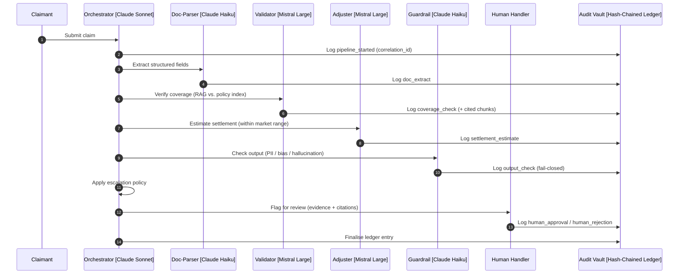

# Agentic Claims POC

A working prototype demonstrating **multi-agent agentic AI for insurance claims processing** at a regulated specialty insurer: retrieval-augmented coverage validation, structured settlement estimation, output guardrails, a tamper-evident audit vault, human-in-the-loop escalation, and provider substitutability — all deployed live.

> **30-second pitch.** A claim is submitted and persisted before any model runs. An orchestrator drives four specialised agents — Doc-Parser (extract), Validator (RAG coverage decision, citing policy clauses), Adjuster (settlement within a market range), Guardrail (PII / bias / hallucinated-citation check) — and a deterministic escalation policy decides auto-settle vs. human review. **Every step is written to a SHA-256 hash-chained audit ledger**, so any past decision is fully reconstructable and the chain is one-click verifiable. The whole thing runs on commodity hosting today and maps cleanly onto an Azure topology for production.

## Headline flow



The full interactive version (and three more diagrams) live in [`diagrams/`](diagrams/).

## What this demonstrates

- **A tiered model strategy** — Claude Sonnet (orchestration), Claude Haiku (fast extraction + output guardrails), Mistral Large (open-weight reasoning for the PII-sensitive coverage and settlement decisions, fine-tunable for the Adjuster).
- **RAG with citation lineage** — claim narratives are embedded and matched against an indexed policy corpus; every coverage decision cites the exact retrieved chunks, and the Validator rejects any citation to a chunk it never saw.
- **A tamper-evident audit vault** — every agent action and every pipeline/human decision is a row in a SHA-256 hash chain; a single mutation anywhere breaks the chain at a locatable point. One-click "Verify chain" in the UI.
- **Decoupled submit → event → pipeline** — a claim is persisted to a system of record before any agent fires; the pipeline is triggered separately (simulating an Azure Service Bus `ClaimReceived` event).
- **Replay and comparison** — re-run any claim under a configured variant (different prompt or model) under a fresh correlation_id; the prior run is never overwritten, and the two are reconstructed from the audit log and diffed side-by-side.
- **An explicit escalation policy** — OR-semantics over named hard rules (guardrail failed, watchlists, cross-jurisdictional) and threshold rules (settlement ceiling, confidence floors), loaded from `policy.yaml`. Every fired rule is recorded.
- **Provider substitutability (DORA Article 28)** — an LLM Gateway mediates every model call; a replay variant has been exercised that swaps the Validator from Mistral to Claude Haiku, and the audit log records the *actual* provider, proving the substitution.
- **Human-in-the-loop** — escalated claims show the evidence (cited clauses, reasoning, guardrail flags); approve/reject writes an `agent='human'` audit entry and moves the claim to a terminal state.
- **An agent test bench** — invoke any single agent on arbitrary input, out-of-band, to inspect its prompt and response.

## Live demo

> **Live URL:** _set after deploy_ — the Vercel frontend (e.g. `https://<app>.vercel.app`); the Render backend's `/health` returns `{"status":"ok","version":"0.7.0"}`.
> A 3-minute walkthrough script is at [`docs/walkthrough.md`](docs/walkthrough.md); the recorded video is kept outside the repo (link shared for the interview).

Three pre-loaded scenarios (the "Load demo claim" buttons on the submission form):

| Scenario | Claim | Expected outcome |
|---|---|---|
| **Auto-approve** | $85,000 commercial water damage | `settled` — no rules fire |
| **Threshold escalation** | $850,000 fire loss | `awaiting_human` — settlement > $250,000 |
| **Guardrail escalation** | $1.4M storm with an unlisted endorsement | `awaiting_human` — `guardrail_failed` |

The guardrail scenario reproduces **deterministically**: the seeded claim drives a demo fixture (a planted hallucinated endorsement) that the Guardrail's regex catches without relying on model non-determinism. The audit trail records `demo_fixture: true`, so the affordance is auditable, not hidden. (See [`docs/design-decisions.md`](docs/design-decisions.md).)

## One-command local setup

Prerequisites: **Python 3.11+ with [`uv`](https://docs.astral.sh/uv/)**, **Node 20+**, **PostgreSQL 17 with pgvector** (native, no Docker). Full prerequisite notes are below.

```bash
# 1. Install Postgres + pgvector (macOS / Homebrew)
brew install postgresql@17 pgvector && brew services start postgresql@17
echo 'export PATH="/opt/homebrew/opt/postgresql@17/bin:$PATH"' >> ~/.zshrc && exec zsh

# 2. Database + env
bash scripts/setup-dev-db.sh          # creates the dev DB, enables pgvector (idempotent)
cp .env.example .env                  # set DATABASE_URL (+ ANTHROPIC_API_KEY / MISTRAL_API_KEY)

# 3. Migrate, seed, index
uv run alembic --config backend/alembic.ini upgrade head
uv run python -m backend.data.seed_claims --allow-truncate
uv run python -m backend.data.index_policy

# 4. Run (two terminals)
uv sync && uv run uvicorn backend.app.main:app --reload     # backend → :8000
cd frontend && npm install && npm run dev                   # frontend → :5173
```

Open `http://localhost:5173/`. The Vite dev server proxies `/health` and `/api/*` to the backend, so no frontend env vars are needed in dev.

<details>
<summary>Detailed prerequisites and database options</summary>

- **Postgres 17** is pinned because the Homebrew `pgvector` bottle ships builds for `postgresql@17`/`@18`. The stack accepts "Postgres 16+"; the local commands target 17.
- `setup-dev-db.sh` verifies your install (psql on PATH, server reachable, version ≥ 16, pgvector available), creates `agentic_claims_dev`, and enables the extension.
- **`DATABASE_URL`** supports either local Postgres (`postgresql://localhost/agentic_claims_dev`) or a **Neon dev branch** (paste the connection string; skip `setup-dev-db.sh`).
- `.env` is gitignored. `ANTHROPIC_API_KEY` and `MISTRAL_API_KEY` are required for live agent runs (not for the test suite, which mocks the LLM boundary).

### Local test database setup

The backend test suite uses **its own database**, separate from the dev DB. The
suite's fixtures TRUNCATE tables between tests, so it must never run against the
deployed Neon database (or any `*.neon.tech` host) — the fixtures refuse to, and
fail loudly if asked. Point the suite at a local test DB once:

```bash
# 1. Create the test database (reuses setup-dev-db.sh via DEV_DB_NAME)
DEV_DB_NAME=agentic_claims_test ./scripts/setup-dev-db.sh

# 2. Configure TEST_DATABASE_URL
cp .env.test.example .env.test
# edit .env.test → TEST_DATABASE_URL=postgresql://USER@localhost:5432/agentic_claims_test
```

The fixtures read `TEST_DATABASE_URL` (from `.env.test`) in preference to
`DATABASE_URL`. They fall back to `DATABASE_URL` only when it is itself non-Neon —
which is how CI works, with `DATABASE_URL` set to a localhost service container and
no `TEST_DATABASE_URL`. `.env.test` is gitignored.

### Test, lint, type-check

```bash
uv run pytest && uv run ruff check . && uv run mypy backend     # backend
cd frontend && npm test && npm run lint && npm run typecheck    # frontend
```
</details>

## Diagrams

<details>
<summary>1 — Headline agent flow</summary>

Source: [`diagrams/1-headline-agent-flow.mmd`](diagrams/1-headline-agent-flow.mmd). The orchestrator drives the four agents in sequence, each logging to the audit vault, with the escalation policy gating human review. Rendered inline above.
</details>

<details>
<summary>2 — RAG zoom (Validator mechanics)</summary>

Source: [`diagrams/2-rag-zoom.mmd`](diagrams/2-rag-zoom.mmd). Embed the narrative with `bge-small-en-v1.5`, cosine-search the top-K policy chunks via pgvector, build the augmented prompt, call the model, and cross-check every cited chunk_id against the retrieved set (the anti-hallucination guard at the RAG layer).
</details>

<details>
<summary>3 — Decoupling event flow</summary>

Source: [`diagrams/3-decoupling-event-flow.mmd`](diagrams/3-decoupling-event-flow.mmd). The claim is persisted to the system of record first; the pipeline is triggered by a separate event (a button click here, a Service Bus message in production).
</details>

<details>
<summary>4 — Production Azure topology</summary>

Source: [`diagrams/4-production-architecture.mmd`](diagrams/4-production-architecture.mmd). The full target deployment: Azure Container Apps, Durable Functions, Service Bus, SQL MI with Ledger Tables, AI Search, AI Foundry private endpoints, Key Vault, Entra ID.
</details>

Interactive (zoomable) versions of all four are linked from [`diagrams/README.md`](diagrams/README.md).

## Design decisions and trade-offs

The questions a reviewer will ask, answered up front (full treatment in [`docs/design-decisions.md`](docs/design-decisions.md)):

- **Why a hand-rolled hash chain, not SQL Server Ledger Tables?** The prototype runs on Postgres; the chain logic is portable and demonstrates the *property* (tamper-evidence) without the production engine. Production swaps in Ledger Tables + a daily digest to immutable Blob Storage.
- **Why an LLM Gateway?** A single mediated boundary makes provider substitution a configuration change (DORA Article 28), and is where prompt logging, cost attribution, and PII redaction live in production. The prototype's Gateway has been exercised across Anthropic and Mistral.
- **Why Mistral *and* Claude?** Tiered cost/capability and provider diversity: Sonnet for orchestration, Haiku for cheap deterministic-ish extraction/guardrails, Mistral (open-weight, fine-tunable, tenant-hostable) for the PII-sensitive coverage and settlement decisions.
- **Why an in-process event bus, not a broker?** A single-process prototype simplification; production uses Service Bus + Durable Functions (which also unlocks the long human-review wait without holding app state).
- **Why a demo fixture for scenario 3?** Guardrail escalation must reproduce reliably for a demo, but a hallucination is non-deterministic. The fixture makes it deterministic *and* records `demo_fixture: true` in the audit — the audit log stays the trusted record.
- **The audit log is the trusted record.** Every additive interface extension since Phase 4 preserves the property that the audit log alone reconstructs and explains any past decision. Concretely, the additive audit-payload extensions are:
  - Adjuster `settlement_estimate`: a full `reasoning` field (untruncated, alongside `reasoning_excerpt`) — so reconstruction is verbatim.
  - Validator `coverage_check`: `llm_call.provider` / `model` report the *actual* provider and model in use, not a hardcoded vendor — so a provider-substitution variant is provable from the log.
  - `pipeline_started` audit payload **and** SSE event: a `variant` field (default `"default"`).
  - `audit_log.agent` CHECK extended to include `'human'`; audit steps `human_approval` / `human_rejection`.
  - `claims.status` CHECK extended to include `'aborted'` (terminal state for a human-rejected claim).
  - Adjuster `settlement_estimate`: a top-level `demo_fixture: bool` (true means the deterministic demo fixture was used and no model was called).

  All are additive (existing keys unchanged). The locked list is in `CLAUDE.md` → "Locked interface extensions since Phase 4".

## Production architecture

The prototype runs on commodity hosting (Render + Vercel + Neon) for fast iteration; the production target is the organisation's Azure tenant, with all data confined to the tenant and all model inference reached over private network paths. Full detail in [`docs/architecture-stack-reference.md`](docs/architecture-stack-reference.md).

| Concern | Development (prototype) | Production (target) |
|---|---|---|
| Frontend / backend hosting | Vercel / Render | Azure Container Apps |
| API edge | Render router | Azure API Management + Entra ID |
| Orchestration | In-process Python async | Azure Durable Functions |
| Event backbone | UI button trigger | Azure Service Bus |
| Claims of record + audit | Neon Postgres + SHA-256 chain | Azure SQL MI + Ledger Tables (+ immutable Blob digest) |
| Vector index | pgvector | Azure AI Search (hybrid) |
| Embeddings | bge-small-en-v1.5 (local) | text-embedding-3-large (Foundry private endpoint) |
| LLMs | Anthropic + Mistral public APIs | Same models via Azure AI Foundry private endpoints |
| Adjuster fine-tune | None | Mistral Large + LoRA on redacted historical claims |
| Secrets / identity | Render env vars | Azure Key Vault + Entra ID managed identities |
| CI/CD + governance | GitHub Actions | Azure DevOps Pipelines + CCB change taxonomy |
| Region / network | Provider defaults, public internet | North Europe primary, private VNet + PrivateLink |

**The six transitions that matter:** LLM provider swap (Gateway config change, no agent edits); audit vault swap (Ledger Tables take over chain integrity); vector store swap (pgvector → AI Search; the embedding model move is the one-way door); workflow swap (async → Durable Functions); event swap (UI trigger → Service Bus); and the governance overlay (the standard/normal/emergency taxonomy + CCB). Detail in the stack reference.

## Reproducible build

Every prompt that built this prototype is archived in [`docs/prompts/`](docs/prompts/), numbered in build order, each paired with the approved plan and the post-execution report. Re-running the prompts in sequence against a fresh Claude Code session reproduces the repository. The outcome of every phase — what was built, test counts, issues — is in [`docs/build-log.md`](docs/build-log.md). Prompts capture intent; the build log captures outcome.

## Change governance and DORA

- [`docs/change-governance.md`](docs/change-governance.md) — the standard / normal / emergency change taxonomy applied to AI changes, with a worked example of each and the CCB workflow.
- [`docs/dora-third-party-register.md`](docs/dora-third-party-register.md) — every third-party provider, its substitution path, whether substitution has been exercised in the prototype, and the DORA Article 28 rationale.

## Documentation index

- [`docs/architecture-stack-reference.md`](docs/architecture-stack-reference.md) — full dev vs. production stack reference
- [`docs/design-decisions.md`](docs/design-decisions.md) — trade-offs in depth
- [`docs/change-governance.md`](docs/change-governance.md) · [`docs/dora-third-party-register.md`](docs/dora-third-party-register.md)
- [`docs/walkthrough.md`](docs/walkthrough.md) — the demo script
- [`docs/verification/phase-7/scenarios.md`](docs/verification/phase-7/scenarios.md) — live-scenario verification evidence
- [`infra/azure-devops-pipeline.yml`](infra/azure-devops-pipeline.yml) — the production CI/CD reference
- [`docs/prompts/`](docs/prompts/) · [`docs/build-log.md`](docs/build-log.md) · [`diagrams/`](diagrams/)
